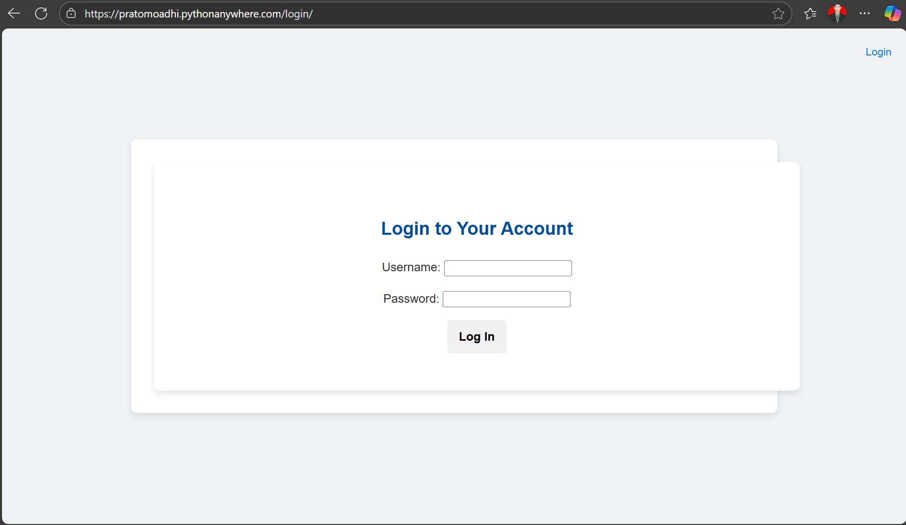
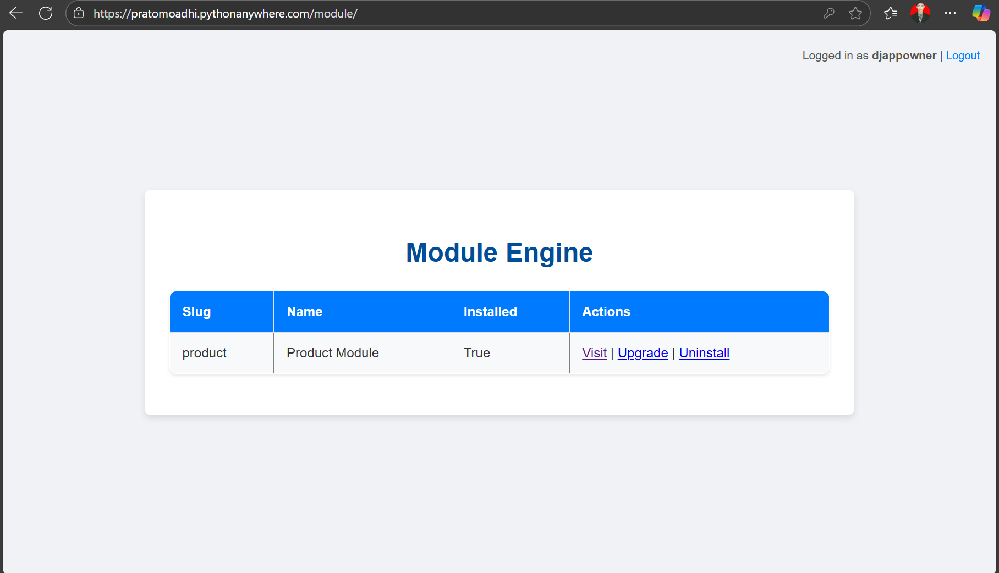
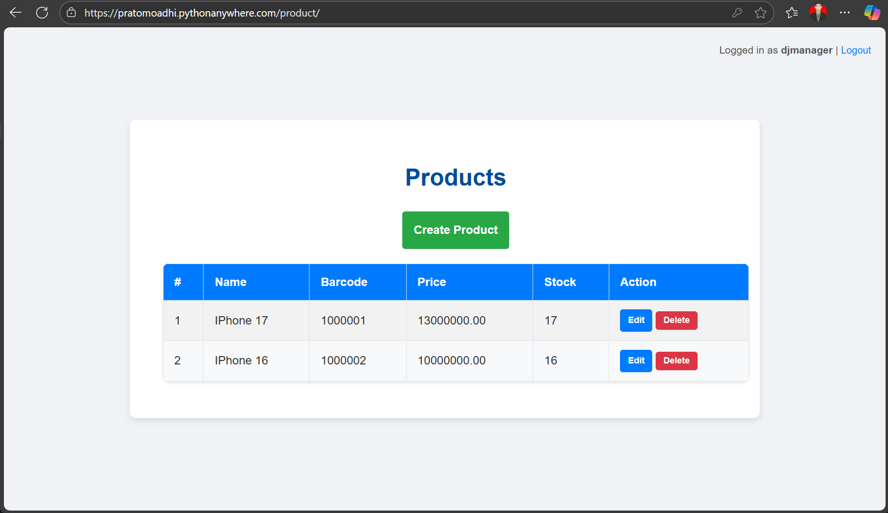

# Django Modular Application

## Overview

This is a simple Django web application that demonstrates a modular architecture. It includes core functionalities such as user authentication and a module engine that allows for the management and integration of different application components, such as the `products` module.

## Features

* **User Authentication:** Secure login and logout functionality to protect application pages.

* **Module Engine:** A central hub to view, install, upgrade, and uninstall different application modules.

* **Product Management:** A dedicated module for performing CRUD (Create, Read, Update, Delete) operations on product data.

## Prerequisites

Before you begin, ensure you have the following installed:

* Python 3.x

* pip (Python package installer)

## Installation

1. **Clone the repository:**

```

git clone [https://github.com/pratomoadhi/django-modular-app](https://github.com/pratomoadhi/django-modular-app)
cd django-modular-app

```

2. **Create a virtual environment (recommended):**

```

python -m venv venv
source venv/bin/activate  \# On Windows: `venv\Scripts\activate`

```

3. **Install the required packages:**
(You will need a `requirements.txt` file listing your project dependencies, such as Django.)

```

pip install -r requirements.txt

```

*Note: If you do not have a `requirements.txt`, you will need to manually install Django by running `pip install Django`.*

4. **Run database migrations:**

```

python manage.py migrate

```

5. **Create product module entry:**

```

python manage.py shell
>>> from apps.engine.models import Module
>>> Module.objects.create(slug='product', name='Product Module', description='Example module product', installed=True)
>>> exit()

```

6. **Create groups and assign permissions (run after product migrations so permissions exist):**

```

python manage.py setup_roles

```

7. **Create a superuser (for admin access):**

```

python manage.py createsuperuser

```

8. **Collect static files for the admin page:**

```

python manage.py collectstatic --noinput

```

9. **Run the development server:**

```

python manage.py runserver

```

The application will now be running at `http://127.0.0.1:8000/`.

## Usage

* **Login:** Navigate to the login page to access authenticated sections of the application.



* **Module Engine:** Once logged in, you can visit the Module Engine page to see a list of available modules and their status. From there, you can install, upgrade, or uninstall modules as needed.



* **Products:** The products module allows you to view a list of products and perform actions such as creating a new product, editing an existing one, or deleting it.



## License

This project is open-source and available under the MIT License.